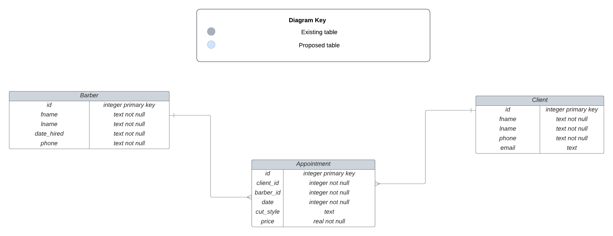

## Barber Shop Challenge

You were hired to build a program for a barber shop where you would enable clients to book appointments with barbers.  A client can book an appointment with many barbers and a barber can have appointments with many clients.  Therefore there is a many to many relationship between clients and barbers through appointments.  Here is an ERD of the models:

## Core Deliverables

### Barber

1.  Barber class must have id, fname, lname,date hired, and phone as properties. Id property must be an integer. Fname,lname,date_hired, and phone properties must be strings. Each barber should have a unique id.

2.  There must be a method get_appointments() that returns a barber's list of all appointments with clients.

3.  There must be a method get_clients_by_hair_cut that returns a list of all clients that requests a certain cut style.

4.  There must be a method get_appointments_by_date where you get a list of all appointments for a certain date.

### Client
1.  Client class must have id,fname,lname,phone, and email as properties. Id property must be an integer while fname,lname,phone, and email must be strings.  Each client should have a unique id.
2.  There must be a method book_appointment where a client books an appointment with a barber.
3.  There must be a method get_appointments that returns a list of all appointments with barbers.
4.  There must be a method get_barbers that returns a list of all barbers that the client has booked an appointment with.

### Appointment
1.  Appointment class must have id,client_id,barber_id, date,cut_style, and price as properties.  Id, client_id, and barber_id must be integers.  Date and cut_style must be text.  Price must be a float of at least 1.  Each appointment should have a unique id.

2.  There must be a method that returns a list of all barbers with booked appointments.

3.  There must be a method that returns a list of all clients with booked appointments.

## Bonus Deliverables

### Barber
1.  There must be a method in the Barber class get_most_frequent_client that returns the client that has booked the most appointments with the barber.

2.  There must be a method in the Barber class highest_spender that returns the client that has spent the most money.

## Extra Bonus Deliverable

### Barber

1.  There must be a method in the Barber class veteran_barbers that returns a list of the barbers that have been working at the barber shop for 5 or more years.

# barber-shop-challenge
